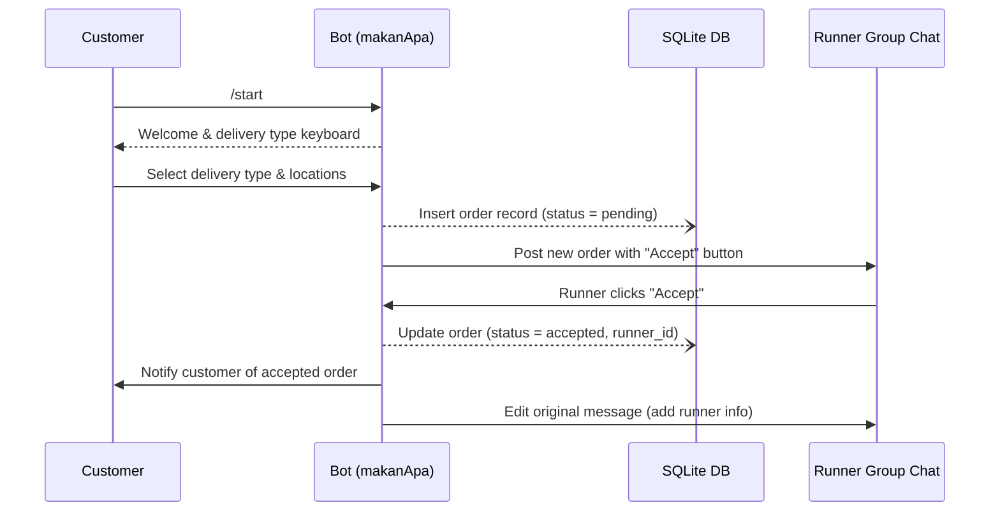

# makanApa Architecture

This document provides a deeper look at how the main components of the makanApa ecosystem interact.

---

## Components

| Component | Technology | Responsibility |
|-----------|------------|----------------|
| **Telegram Bot** (`bot.py`) | python-telegram-bot v20 | Implements conversation flow, commands and inline keyboards. |
| **SQLite DB** (`data/makanApa.db`) | SQLite 3 | Stores customers, runners and order metadata. |
| **Runner Group Chat** | Telegram | Private super-group where runners accept new orders via inline buttons. |
| **Logging** (`data/bot.log`) | Python `logging` | Persist debug & audit logs for each interaction. |

---

## Sequence Diagram

---

## Data Flow
1. **Customer Interaction** — Bot collects delivery details and confirms the order.
2. **Database Persistence** — Each order is written to SQLite ensuring durability.
3. **Runner Notification** — Bot posts the order to the runner group with an inline *Accept* button.
4. **Order Acceptance** — First runner to click *Accept* is recorded; status moves to *accepted*.
5. **Updates** — Bot notifies both parties and edits the runner-group message accordingly.

---

## Error Handling & Resilience
• All database operations are wrapped in try/except blocks where failures are logged.
• Network errors from Telegram API are retried by `python-telegram-bot`’s built-in mechanisms.
• Logger writes to both console (for cloud hosting logs) and `data/bot.log` (for historic analysis).